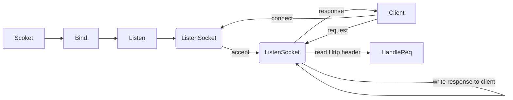
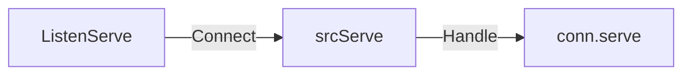

## Go Lang Web(net/http)

---

### Simple HTTP Server

```go
package main
import (
	"fmt"
    "log"
    "net/http"
)

func main(){
    http.HandleFunc("/",func(rw http.ResponseWirter, r *http.Request){
         r.ParseForm() //can't get the body
		fmt.Println(r.Form) //get the parse body info
		fmt.Println("URL:", r.URL.Scheme) 
		fmt.Println("path", r.URL.Path) //get URL path,current is "/"
		for key, value := range req.Form {
			fmt.Println("key:", key) //get key from the form
			fmt.Println("value:", value) //get value from the form
		}
		fmt.Fprintf(rw, "Hello Http") // wirte to response
    })
    
    err := http.ListenAndServe(":8080",nil) //this handler is nil,will call defalutServeMux
    if err != nil{
        log.Fatal("Listening server error:", err)
    }
}
```

### What it does behind the Scene?



> **Step 1**: Create ```ListenSocket``` and ```port``` ,waiting ```Client``` to connect
>
> **Step 2**: ```ListenSocket``` accepted ```Client``` request, and return the``Client Socket`` and communicate with server     			via ```Client Socket```
>
> **Step 3**: ```Client Socket``` read the ```HTTP request``` and send it to  correspond ```Handler Function```. After processed , send response to the ```Client``` via ```Client Socket```

###  How Go work with HTTP 

* Via ``ListenAndServe`` to handle the work. 
  * Create a ``server`` Object
  * Call ``net.Listen("tcp",addr)`` => setting ``TCP`` and ``Port``

```go
//from GO Land document
//Handling Request
func (srv *Server) Serve(l net.Listener) error {
    defer l.Close() //c
    var tempDelay time.Duration // how long to sleep on accept failure
    for {
        rw, e := l.Accept()  //Accecpet Request from net.Listener
        if e != nil { //TCP connecting error
            if ne, ok := e.(net.Error); ok && ne.Temporary() {
                if tempDelay == 0 {
                    tempDelay = 5 * time.Millisecond
                } else {
                    tempDelay *= 2
                }
                if max := 1 * time.Second; tempDelay > max {
                    tempDelay = max
                }
                log.Printf("http: Accept error: %v; retrying in %v", e, tempDelay)
                time.Sleep(tempDelay)
                continue
            }
            return e
        }
        tempDelay = 0
        c, err := srv.newConn(rw) //Create a conne() for each Request
        if err != nil {
            continue
        }
        go c.serve() //Put the request to goroutine
        
        /*
        	In Goroutine
        	c.serve will call c.reqdRequest()
        	parse the request and pass to correspond handler function
        	
        	handler function? where is it? => the second argument of ListenAndServe(":8080",nil)
        	The second argument is following HttpHandler interface
        	now it is set to nil, handler = DefaultServeMux ,using serverHTTP default handler 
        	that we set  http.HandleFunc("/",func(rw http.ResponseWirter, r *http.Request)
        */
    }
}
```

### process



* Step 1: ``ListenAndServe`` Call ``net.Listen("tcp",addr)``and connect  to ``tcp`` with ``port``
* Step 2: ``ListenAndServe`` Call ``src.Serve(l net.Listener)`` to create the ``Conn`` for each ``request``
* Step 3: Handling the ``Conn`` in ``Gotoutine``. Read the ``Request`` via ``c.readRequest``, and match the ``Request URL`` and ``Handler Function`` : ``handler.ServerHTTP(req,res)``

---

### How conn work behind goroutine

> Each in-coming request will use ``GORoutine``to handle，due to not idle

```go
conn, err := srv.newConn(rw) //create a connection with the request
if err != nil{
    continue
}
go conn.serve() //serve the request for the connection(request),and conn will pass it to correspond handler
```

> How ``Handler function``(router) work in ``GO``?

***Following structure below***

---

```go
type ServeMux struct{ //each conn is this struct
    mu sync.RWMutex   //鎖，由於請求涉及到併發處理，因此這裡需要一個鎖機制(mutex for the request(coz goroutine(Thread safety)))
    m  map[string]muxEntry  // 路由規則，一個 string 對應一個 mux 實體，這裡的 string 就是註冊的路由表示式(which mutex is the current router using)
    hosts bool // 是否在任意的規則中帶有 host 資訊
} 
```

```go
type muxEntry struct {
    explicit bool   // 是否精確匹配
    h        Handler // 這個路由表示式對應哪個 handler

    pattern  string  //匹配字串
}
```

```go
//Handle
type Handler interface { //each handler need to implememnt this interface
    ServeHTTP(ResponseWriter, *Request)  // 路由實現器,each handler need to implment this function
}
```

---

#### Get Handler for the request,how it work?

>  According to ``HandlerFunc`` in ``http``:`` http.HandleFunc(r,w)``

```go
//HandleFunc implement Handler interface,and calling our funcion
type HandleFunc func(ResponseWriter, *Request)

// ServeHTTP calls f(w, r).
func (f HandleFunc) ServeHTTP(w ResponseWriter, r *Request) {
    f(w, r) 
}
```

> ​	Get the handler for specific coming request

```go
func (mux *ServeMux) ServeHTTP(w ResponseWriter, r *Request) {
    if r.RequestURI == "*" {
        w.Header().Set("Connection", "close")
        w.WriteHeader(StatusBadRequest)
        return
    }
    h, _ := mux.Handler(r) //get the handler for current request
    h.ServeHTTP(w, r) //then run ServeHTTP function to handle request
}
```

```go
//mux.Handler definition
//Handle match by request host+ URL Path to get the handler
func (mux *ServeMux) Handler(r *Request) (h Handler, pattern string) {
    if r.Method != "CONNECT" {
        if p := cleanPath(r.URL.Path); p != r.URL.Path {
            _, pattern = mux.handler(r.Host, p)
            return RedirectHandler(p, StatusMovedPermanently), pattern
        }
    }
    return mux.handler(r.Host, r.URL.Path)
}

func (mux *ServeMux) handler(host, path string) (h Handler, pattern string) {
    mux.mu.RLock()
    defer mux.mu.RUnlock()

    // Host-specific pattern takes precedence over generic ones
    if mux.hosts {
        h, pattern = mux.match(host + path) //matching by host + path host:127.0.0.1 and path:/
    }
    if h == nil {
        h, pattern = mux.match(path) //if host is null ,matching by path only path:/
    }
    if h == nil {
        h, pattern = NotFoundHandler(), "" //else no any handler has matched 
    }
    return
}

```


----

### A Custom Handler by following ``Handler Interface``

> **All Handler must follow ``Handler`` Interface **

```go
package main

import (
	"fmt"
	"net/http"
)

type MyMutex struct{}

//custom Handler
func (f *MyMutex) ServeHTTP(w http.ResponseWriter, r *http.Request) {
	fmt.Printf("Request come: %v\n", r.URL.Path)
	if r.URL.Path == "/" {
		httpHelloWord(w, r)
		return
	}

	if r.URL.Path == "/test" {
		httpTest(w, r)
		return
	}
	http.NotFound(w, r)
	return
}

func httpHelloWord(w http.ResponseWriter, r *http.Request) {
	fmt.Fprint(w, "Custom Handler")
}

func httpTest(w http.ResponseWriter, r *http.Request) {
	fmt.Fprint(w, "Test URL Handler")
}
func main() {
	myMux := new(MyMutex)
	fmt.Println("Server is on!")
	http.ListenAndServe(":8080", myMux)
}
```

